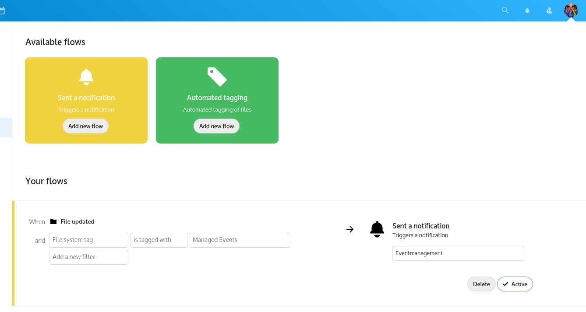
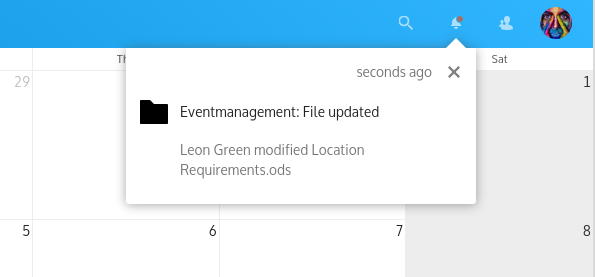

<!--
  - SPDX-FileCopyrightText: 2020 Nextcloud GmbH and Nextcloud contributors
  - SPDX-License-Identifier: AGPL-3.0-or-later
-->
# Nextcloud Flow Notifications

**📝 Notification action for Nextcloud Flow**

### 🔩 Configure your flow

### 🔔 Receive notifications

💡 To use the `Flow Notifications` app, ensure that the [Notifications](https://github.com/nextcloud/notifications) app is installed and enabled. The `Notifications` app provides the necessary APIs for the `Flow Notifications` app to work correctly.

## 🏗 Development setup

1. ☁ Clone this app into the `apps` folder of your Nextcloud: `git clone https://github.com/nextcloud/flow_notifications.git`
2. 👩‍💻 In the folder of the app, run the command `npm ci && npm run dev` to install dependencies and build the Javascript.
3. ✅ Enable the app through the app management of your Nextcloud
4. 🎉 Partytime! Help fix [some issues](https://github.com/nextcloud/flow_notifications/issues) and [review pull requests](https://github.com/nextcloud/flow_notifications/pulls) 👍

### 🧙 Advanced development stuff

To build the Javascript whenever you make changes, you can also use `npm run build`. Or `npm run watch` to automatically rebuild on every file save.

## ♥ How to create a pull request

This guide will help you get started:
- 💃 [Opening a pull request](https://opensource.guide/how-to-contribute/#opening-a-pull-request)

## ✌ Code of conduct

The Nextcloud community has core values that are shared between all members during conferences, hackweeks and on all interactions in online platforms including [Github](https://github.com/nextcloud) and [forums](https://help.nextcloud.com). If you contribute, participate or interact with this community, please respect [our shared values](https://nextcloud.com/code-of-conduct/). 😌
